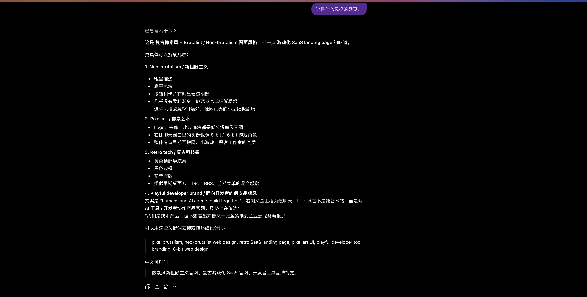
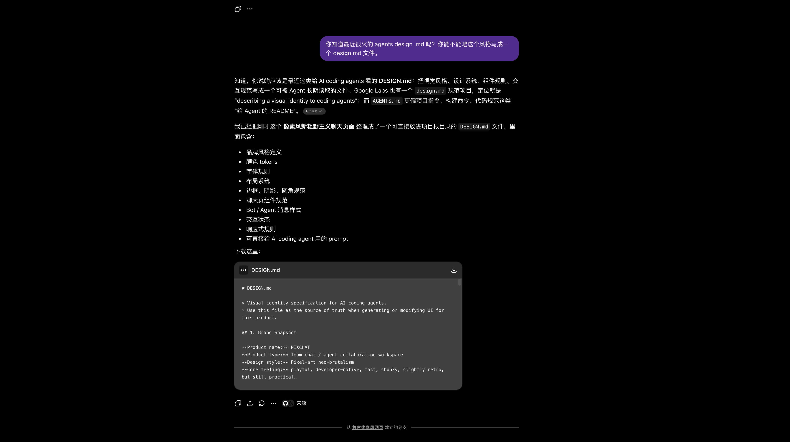
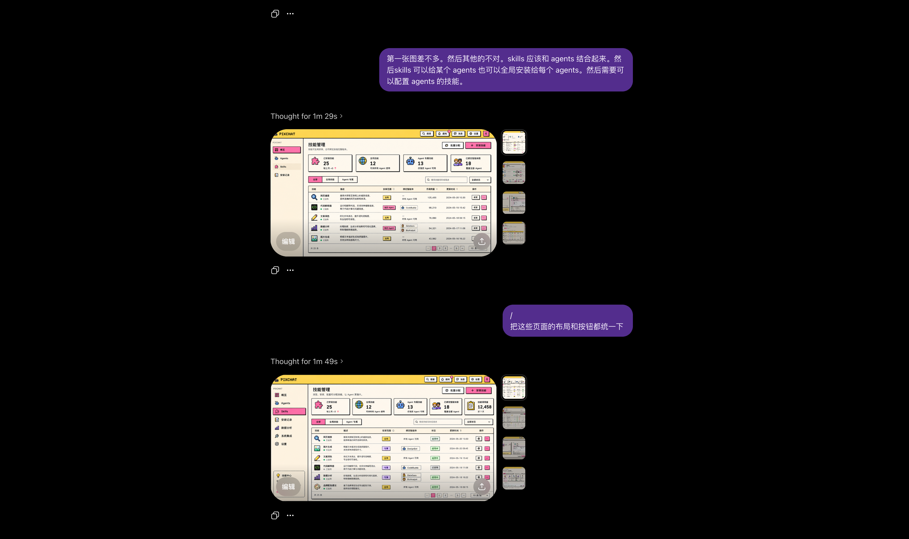
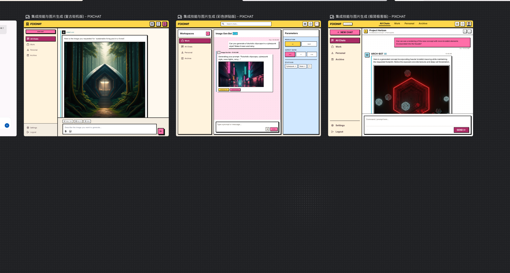
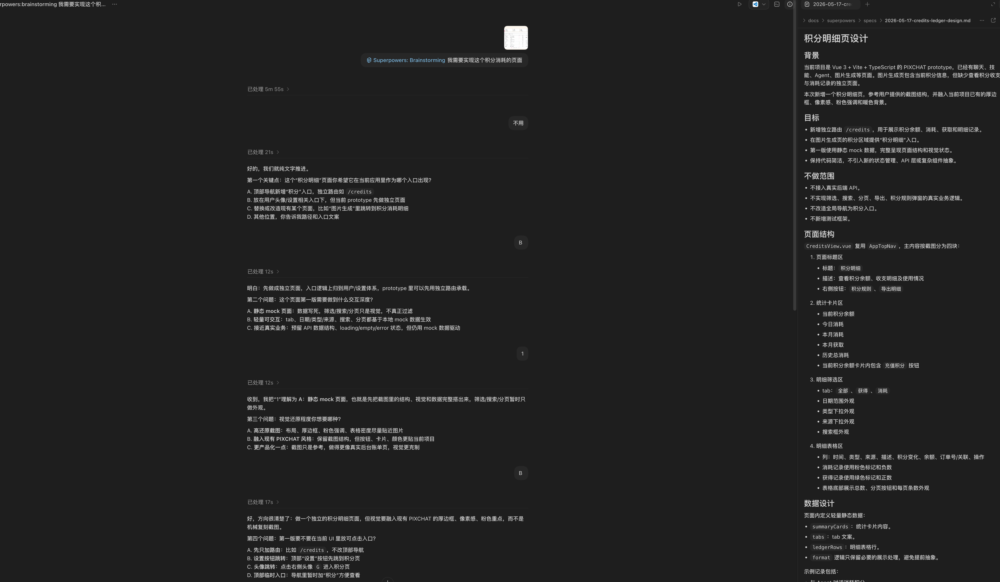
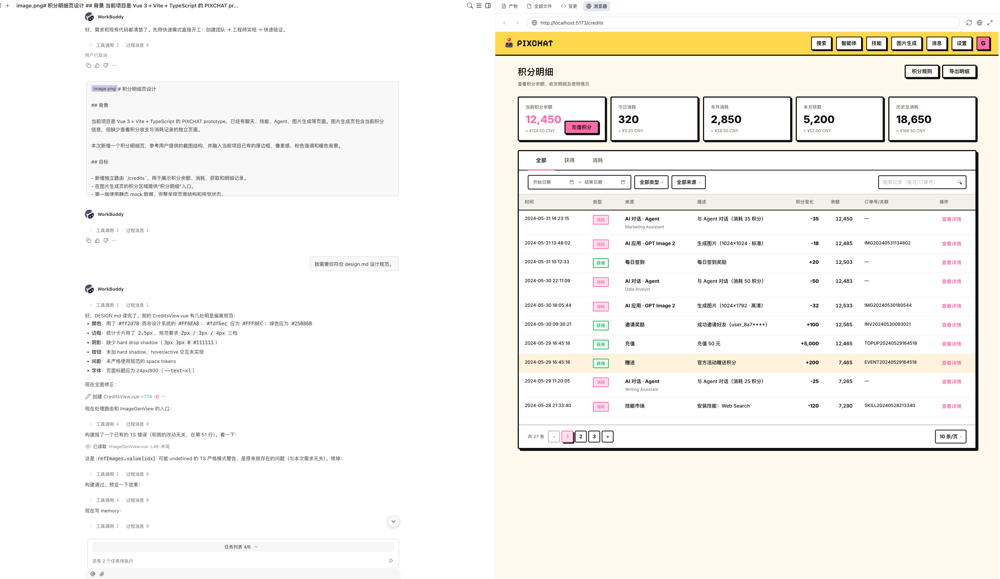
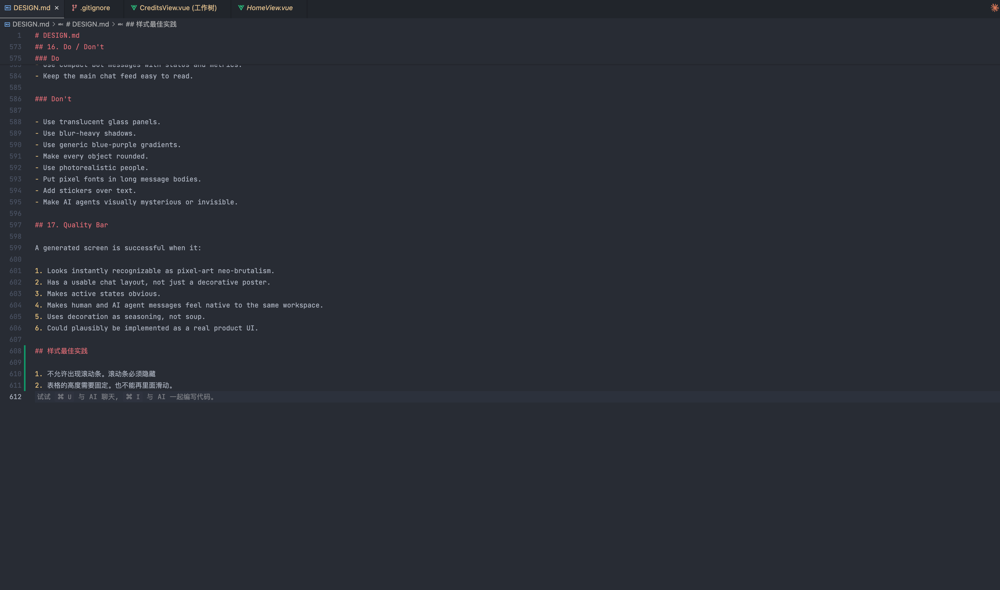
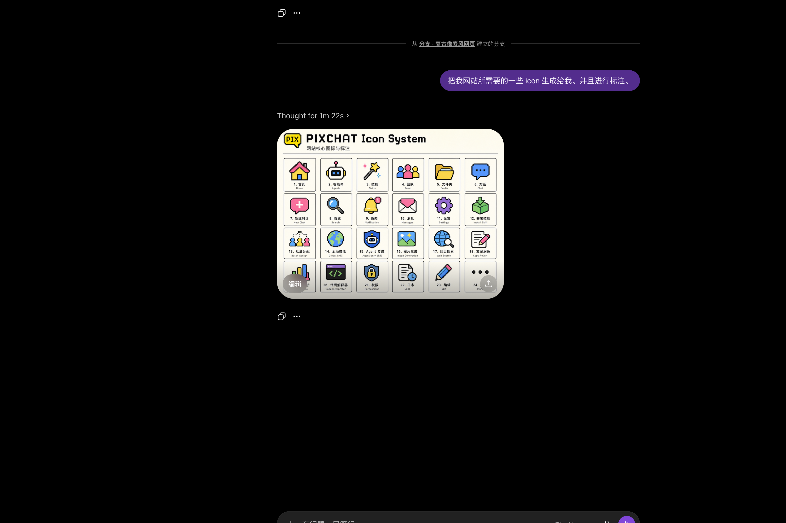

# 使用 AI 开发网页的流程

用 AI 开发网页，核心是把设计意图转化成 AI 能执行的规范，再通过工具验证和迭代反馈逐步逼近目标。

整个流程分为：**写需求文档 → 建立设计规范 → 沟通需求 → 开发 → AI 自检 → 人工验收 → 写开发文档 → 部署 → 沉淀工作流**。

| 步骤 | 内容 | 工具 |
|------|------|------|
| 1 | 用 documentation-coach 写需求文档 | `documentation-coach` |
| 2 | 参考网站风格 | ChatGPT / Claude |
| 3 | 生成 DESIGN.md 视觉规范 | ChatGPT |
| 4 | 生成设计稿 | ChatGPT / Stitch |
| 5 | 和 AI 沟通需求 | Claude Code |
| 6 | 开始开发 | Claude Code |
| 7 | AI 自动验证页面 | `playwright-cli` |
| 8 | AI 自动精调 bug | `chrome-devtools-cli` |
| 9 | 人工验收 | 浏览器 |
| 10 | 更新 DESIGN.md + 补充素材 | ChatGPT / GPT Image |
| 11 | 写开发文档 | `documentation-coach` |
| 12 | 部署 | `deploy-to-vercel` |
| 13 | 沉淀工作流到 CLAUDE.md | 文本编辑 |

---

## 第一步：用 documentation-coach 写需求文档

开发前先把需求写清楚。用 `documentation-coach` skill 生成需求文档，明确：

- 要做什么页面、给谁用
- 核心功能和业务规则
- 验收标准

需求文档写清楚了，后续和 AI 沟通时就有明确的依据，避免反复返工。

---

## 第二步：参考网站风格

找到你想参考的网站，截图给 AI，让它理解你期望的视觉风格。



---

## 第三步：生成 DESIGN.md 视觉规范

把参考截图发给 ChatGPT，让它提炼出一份 `DESIGN.md` 视觉规范文档。这份文档会贯穿整个开发过程，作为 AI 生成代码时的约束依据。



`DESIGN.md` 通常包含：
- 色彩系统（主色、辅色、背景色、文字色）
- 字体规范（字号、字重、行高）
- 间距系统（padding、margin、gap 的基准单位）
- 组件风格（圆角、阴影、边框）
- 响应式断点

---

## 第四步：生成设计稿

有了视觉规范后，让 ChatGPT 根据 `DESIGN.md` 生成具体页面的设计稿，作为开发的视觉参考。



`DESIGN.md` 也可以直接导入 [Stitch](https://stitch.withgoogle.com/) 使用，让设计稿和规范保持一致。



---

## 第五步：和 AI 沟通需求

拿着设计稿和 AI 确认页面需求：功能点、交互逻辑、数据结构。这一步要把模糊的想法变成明确的开发任务。



沟通时尽量明确：
- 页面有哪些区块
- 每个区块的交互行为
- 数据从哪里来（静态 / API）

---

## 第六步：开始开发

需求确认后开始开发，**明确要求 AI 遵循 `DESIGN.md` 中的设计规范**，避免 AI 自由发挥导致风格不一致。



提示词示例：

```
请根据 DESIGN.md 中的规范开发这个页面，
严格使用文档中定义的色彩、字体和间距系统。
```

---

## 第七步：AI 自动用 playwright-cli 验证页面

开发完成后，让 AI 主动调用 `playwright-cli` 自动检查页面。这一步由 AI 自主完成，不需要人工介入，AI 会自动截图、抓取页面结构并给出检查报告，验证：

- 视觉效果是否符合 `DESIGN.md` 规范
- 各功能是否正常运行
- 响应式布局是否正确

---

## 第八步：AI 自动用 chrome-devtools-cli 精调 bug

当 playwright-cli 发现细节 bug 时，AI 会进一步调用 `chrome-devtools-cli` 定位根因：

- 检查具体元素的样式
- 查看网络请求
- 读取控制台报错

这两步都由 AI 自动完成，形成"发现问题 → 定位问题 → 修复"的闭环，**无需人工介入**。

---

## 第九步：人工验收

AI 自检通过后，由你进行最终验收：确认页面效果、交互体验是否符合预期。如有问题，反馈给 AI 进入下一轮迭代。

---

## 第十步：更新 DESIGN.md

开发过程中沉淀下来的设计决策，及时写回 `DESIGN.md`，让规范文档保持最新状态，方便后续页面复用。



此外，页面中缺失的小图标、插图等素材，可以让 GPT 生成并补充进去，完善页面细节。



---

## 第十一步：用 documentation-coach 写开发文档

人工验收通过后，用 `documentation-coach` skill 整理项目文档。它会根据文档类型给出结构模板和维护建议，支持：

- **开发文档**：环境搭建、目录结构、本地运行、常见问题
- **需求文档**：功能描述、业务规则、验收标准
- **部署文档**：环境配置、部署步骤、回滚方案
- **架构文档**：技术选型、模块划分、数据流

文档建议按以下原则分放：
- **放仓库**（`README.md` 或 `docs/`）：开发文档、架构说明、部署指南
- **放 Wiki**：需求文档、评审记录、产品变更日志

---

## 第十二步：部署

文档整理完成后，使用 `deploy-to-vercel` skill 一键部署，拿到预览链接。

---

## 第十三步：把工作流写入 CLAUDE.md / AGENTS.md

每个项目都有自己的规范和习惯，把它们写进 `CLAUDE.md`（Claude Code 读取）或 `AGENTS.md`（通用 agent 读取），AI 下次打开项目就能直接按你的方式工作，不用每次重新解释。

典型内容包括：

```markdown
## 设计规范
- 所有样式必须遵循 DESIGN.md
- 禁止使用内联样式，统一用 Tailwind class

## 开发规范
- 组件放 src/components/，页面放 src/pages/
- 新组件必须支持响应式，断点参考 DESIGN.md

## 验证流程
- 开发完成后先用 playwright-cli 自检
- 发现 bug 用 chrome-devtools-cli 定位
- 自检通过后再通知我人工验收

## 部署
- 使用 deploy-to-vercel skill 部署到预览环境
```

**关键是持续迭代**：每次发现 AI 做了你不喜欢的事，或者你找到了更顺手的方式，就更新这个文件。经过几个项目的积累，`CLAUDE.md` 会越来越贴合你自己的工作流，AI 的输出质量也会随之提升。

---

## 推荐 Skills

| Skill | 用途 |
|-------|------|
| `playwright-cli` | AI 自动截图、检查页面功能和视觉是否符合规范 |
| `chrome-devtools-cli` | AI 自动定位 bug，检查样式、网络请求和控制台 |
| `documentation-coach` | 指导编写开发文档、需求文档、部署文档，提供结构模板 |
| `deploy-to-vercel` | 部署到 Vercel，生成预览链接 |

详见 [Coding Skills](/skills/categories/coding)。
